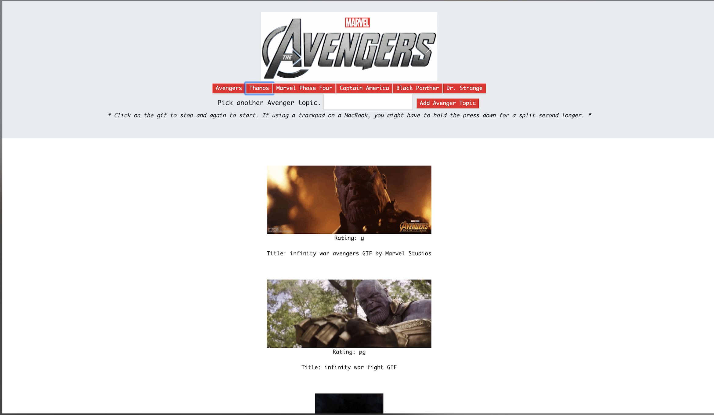

# gifTastic

## Page preview: 


## About the project:
We had to build an app that gets data from the GIPHY Developers API. The specs are as follows:

  * When the user clicks on a button, the page should grab 10 static, non-animated gif images from the GIPHY API and place them on the page.
  * When the user clicks one of the still GIPHY images, the gif should animate. If the user clicks the gif again, it should stop playing.
  * Under every gif, display its rating (PG, G, so on).
  * Only once you get images displaying with button presses should you move on to the next step.
  * Add a form to your page takes the value from a user input box and adds it into your topics array. Then make a function call that takes each topic in the array remakes the buttons on the page.

## Techologies used to build:
  * HTML
  * CSS
  * Bootstrap
  * jQuery
    * Ajax
  * Javascript
  * GIPHY Developers API

## Methodology:

I went back and reviewd the class activies on Ajax to build this app. I also consulted the jQuery docs and w3schools website. I ran into some issues with the start-stop function but after discussing with my class-mates, I found out it was mostly a syntax issue. Loved this project!

## Code Snippets I like:
I like this below because I was able to add many data attributes to the results data. This also allow me to use the data attribute to play and pause each gif on the page.
```
for (var i = 0; i < results.length; i++) {
        // The reason we are creating 2 different gif divs is to keep the numbert of gifs loaded per subject click to 10
        var forGifsTwo = $('<div class="gify">');
        var forGifsTwo = $('<div>');
        forGifsTwo.attr('class', 'gify');
        var marvelImage = $('');
        // adding ratings and titles data from the API through targeting their key value pair.
        var rating = $('<p>').text('Rating: ' + results[i].rating);
        var title = $('<p>').text('Title: ' + results[i].title);
        // These are the attributes and classes needed in order to target the gif images for the start and stop function.
        marvelImage.attr('src', results[i].images.fixed_height_still.url); // <-- results[i].images....is how you specify what to get from the API.
        marvelImage.attr('data-animate', results[i].images.fixed_height.url);
        marvelImage.attr('data-still', results[i].images.fixed_height_still.url);
        marvelImage.attr('data-state', 'still');
        marvelImage.addClass('gif')
          // This appends the images to the DOM along with their ratings and titles. The ratings and titles were captured by setting the results[i]. to their object key value pair. Just like getting the gifs.
        forGifsTwo.append(marvelImage);
        forGifsTwo.append(rating);
        forGifsTwo.append(title);
        gifs.prepend(forGifsTwo);
      }
```
This I like because I was able to add an event listener to each gif image to play and pause it using the data attributes described above.
```
$(document).on('click', '.gif', function() {
  var state = $(this).attr("data-state");
  if (state === "still") {
    var animate = $(this).attr("data-animate");
    $(this).attr("src", animate);
    $(this).attr("data-state", "animate");
  } else {
    $(this).attr("src", $(this).attr("data-still"));
    $(this).attr("data-state", "still");
  }
});
```

## Links to portfolio page: 

https://github.com/Olisun/Updated-Portfolio-Page

